# Codex++

<p align="center">
  
</p>

<p align="center">
  中文 | <a href="README_EN.md">English</a>
</p>

<p align="center">
  
  
  
  
  
</p>

Codex++ 是面向 Codex App 的外部增强启动器和管理工具。它不修改 Codex App 原始安装文件，而是通过外部 launcher 启动 Codex，并使用 Chromium DevTools Protocol 注入增强脚本。

## 极义codex 二开状态

当前工作树已经进入“极义codex”国产版短期方案：macOS 主入口先进行本地手机号验证码登录，验证后仍停留在极义账号门禁页，由用户手动点击进入内置完整 Codex 客户端，模型请求默认由阿里百炼千问兼容接口 / 极义中转纯 API 和极义本地请求代理接管，APIMart 保留为备选，不要求用户使用 ChatGPT 账号。

已完成能力、验收命令和后续待办见：[极义codex 国产版开发状态](docs/极义codex_国产版开发状态.md)。

## 快速使用

从 [GitHub Releases](https://github.com/BigPizzaV3/CodexPlusPlus/releases) 下载最新版安装包：

- macOS Intel：`JiyiCodex-*-macos-x64.dmg`
- macOS Apple Silicon：`JiyiCodex-*-macos-arm64.dmg`

安装后会有两个入口：

- `极义codex`：国产版主入口，先手机号验证码登录，验证后点击“进入 Codex”才启动内置 Codex 使用界面。
- `极义codex 管理工具`：配置、维护、日志和供应商管理入口。

当前极义版先只交付 macOS。macOS DMG 会安装 `/Applications/极义codex.app` 和 `/Applications/极义codex 管理工具.app`，不会覆盖 `/Applications/Codex.app`；包内客户端固定为 `/Applications/极义codex.app/Contents/Resources/JiyiCodexClient.app`，主入口缺少该客户端时会直接报错，不会兜底打开原版 Codex。内置客户端会移除原版 `codex://` URL Scheme 和 Sparkle 更新身份，并强制使用极义专用浏览器用户数据目录和隔离环境变量，避免抢占原版 Codex 的登录回调、更新链路、Electron 会话状态或通用 OpenAI/百炼/APIMart 运行环境。

## 赞助商

<p align="center">
  <a href="https://jojocode.com/">
    
  </a>
</p>
<p align="center">
  <a href="https://jojocode.com/"><strong>JOJO Code｜Codex++ 官方中转站</strong></a><br>
  Codex++ 官方中转站，主打稳定接入和划算价格，支持 GPT-5.5、GPT-5.4、Claude Opus 4.8、Claude Opus 4.7、gpt-image-2 等模型与图像能力，适合日常开发、团队协作和长期项目工作流。
</p>

<a href="mailto:1727532@qq.com">想显示在下方？</a>
<p align="center">
</p>
<table>
  <tr>
    <th width="180">🏆 赞助商 🏆</th>
    <th>介绍</th>
  </tr>
  <tr>
    <td align="center">
      <a href="https://jojocode.com/">
        
      </a>
    </td>
    <td><a href="https://jojocode.com/"><strong>JOJO Code｜Codex++ 官方中转站</strong></a><br>感谢 JOJO Code 赞助本项目。JOJO Code 是 Codex++ 官方中转站，提供价格划算、稳定易接入的 Codex API 中转服务，支持 GPT-5.5、GPT-5.4、Claude Opus 4.8、Claude Opus 4.7、gpt-image-2 等模型与图像能力，适合日常开发、快速配置、团队协作和长期使用。</td>
  </tr>
  <tr>
    <td align="center">
      <a href="https://aigocode.com/invite/CodexPlusPlus">
        
      </a>
    </td>
    <td><a href="https://aigocode.com/invite/CodexPlusPlus"><strong>AIGoCode</strong></a><br>感谢 AIGoCode 赞助了本项目！AIGoCode 是一个集成了 Claude Code、Codex 以及 Gemini 最新模型的一站式平台，为你提供稳定、高效且高性价比的AI编程服务。本站提供灵活的订阅计划，支持多风险，国内直连，无需魔法，极速响应。AIGoCode 为 CodexPlusPlus 的用户提供了特别福利，通过<a href="https://aigocode.com/invite/CodexPlusPlus">此链接注册</a>的用户首次充值可以获得额外10%奖励额度！</td>
  </tr>
  <tr>
    <td align="center">
      <a href="https://www.packyapi.com/">
        
      </a>
    </td>
    <td><a href="https://www.packyapi.com/"><strong>PackyCode</strong></a><br>感谢 PackyCode 赞助了本项目！PackyCode 是一家稳定、高效的API中转服务商，提供 Claude Code、Codex、Gemini 等多种中转服务。PackyCode 为本软件的用户提供了特别优惠，使用此链接注册并在充值时填写"CodexPlusPlus"优惠码，首次充值可以享受9折优惠！</td>
  </tr>
  <tr>
    <td align="center">
      <a href="https://apikey.fun/register?aff=CODEX">
        
      </a>
    </td>
    <td><a href="https://apikey.fun/register?aff=CODEX"><strong>APIKEY.FUN</strong></a><br>感谢 APIKEY.FUN 赞助了本项目！APIKEY.FUN 是一家致力于提供开放、稳定、高性价比的全球主流大模型的 AI 中转站。平台支持 Claude、OpenAI、Gemini 等热门模型的 API 中转服务，价格低至官方原价的 7%。通过专属链接<a href="https://apikey.fun/register?aff=CODEX">注册 APIKEY</a>，可享受最高充值永久 95 折优惠。</td>
  </tr>
  <tr>
    <td align="center">
      <a href="https://runapi.co/register?aff=AWJq">
        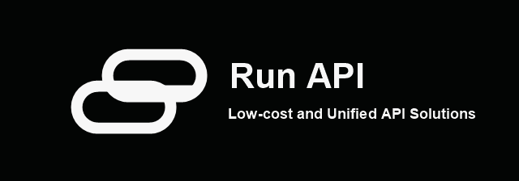
      </a>
    </td>
    <td><a href="https://runapi.co/register?aff=AWJq"><strong>RunAPI</strong></a><br>感谢 RunAPI 赞助了本项目！RunAPI 是高效稳定的 API OpenRouter 平替平台，一个 API Key 即可访问 OpenAI、Claude、Gemini、DeepSeek、Grok 等 150+ 主流模型，低至 1 折，极其稳定，可以无缝兼容 Claude Code、OpenClaw 等工具。</td>
  </tr>
  <tr>
    <td align="center">
      <a href="https://www.0029.org/?promo=AFF11F">
        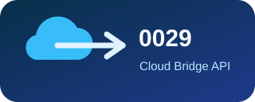
      </a>
    </td>
    <td><a href="https://www.0029.org/?promo=AFF11F"><strong>0029云桥｜codex api中转站(gpt5.5 gpt-image-2)</strong></a><br>支持个人和企业接入。包月套餐/按量计费，Pro/Plus 号池，全站接口稳定可用，7×24 小时技术支持！</td>
  </tr>
  <tr>
    <td align="center">
      <a href="https://rawchat.cn">
        
      </a>
    </td>
    <td><a href="https://rawchat.cn"><strong>RawChat｜Codex 中转站</strong></a><br>老牌中转站，支持包月套餐。低倍率调用，高缓存命中，Pro/Plus 号池，全天专人维护。</td>
  </tr>
  <tr>
    <td align="center">
      <a href="https://coder.visioncoder.cn">
        
      </a>
    </td>
    <td><a href="https://coder.visioncoder.cn"><strong>VisionCoder 开发平台</strong></a><br>感谢 VisionCoder 对本项目的支持。VisionCoder 开发平台是一个可靠高效的 API 中继服务提供商，提供 Claude Code、Codex、Gemini 等主流 AI 模型，帮助开发者和团队更轻松地集成 AI 功能，提升工作效率。VisionCoder 还为我们的用户提供 <a href="https://coder.visioncoder.cn">Token Plan</a> 限时活动：购买 1 个月，赠送 1 个月。</td>
  </tr>
  <tr>
    <td align="center">
      <a href="https://aihub2api.cloud/register?promo=CODEXPLUSPLUS">
        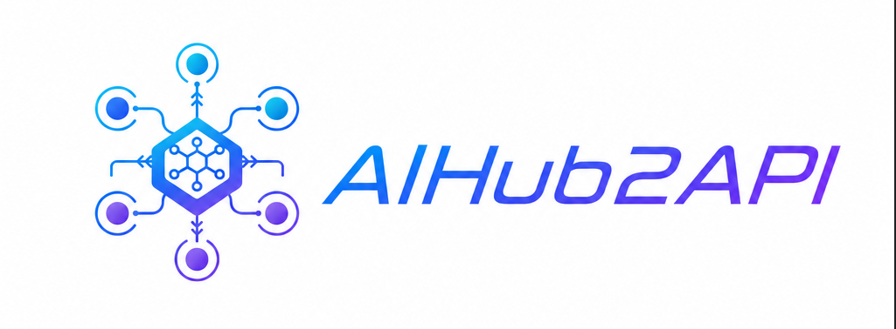
      </a>
    </td>
    <td><a href="https://aihub2api.cloud/register?promo=CODEXPLUSPLUS"><strong>AIHub2API</strong></a><br>感谢 AIHub2API 赞助了本项目！AIHub2API 是一家稳定、高效的 API 中转服务商，专注 Codex 中转业务，提供高缓存命中、低倍率的中转服务，网络链路优化无需使用魔法，极速响应，价格低至官方原价的 1%。通过<a href="https://aihub2api.cloud/register?promo=CODEXPLUSPLUS">专属链接注册 AIHub2API</a>，赠送 10 美金体验额度。</td>
  </tr>
  <tr>
    <td align="center">
      <a href="https://www.compshare.cn/?ytag=GPU_YY_git_codex++">
        
      </a>
    </td>
    <td><a href="https://www.compshare.cn/?ytag=GPU_YY_git_codex++"><strong>优云智算</strong></a><br>感谢优云智算赞助了本项目！优云智算是 UCloud 旗下 AI 云平台，主打包月、按次的高性价比国模 Agent Plan 套餐，低至 49 元/月起。同时提供官转稳定海外模型，支持接入 Claude Code、Codex 及 API 调用，支持企业高并发、7×24 技术支持、自助开票。通过此链接注册的用户，可得免费 5 元平台体验金！</td>
  </tr>
  <tr>
    <td align="center">
      <a href="https://cubence.com?source=codexplusplus">
        
      </a>
    </td>
    <td><a href="https://cubence.com?source=codexplusplus"><strong>Cubence</strong></a><br>感谢 Cubence 对本项目的支持。Cubence 是一家致力为客户提供稳定、高效的 API 中转服务商。从 25 年 9 月运营至今，提供了 Claude Code、Codex、Gemini 等多种模型支持。Cubence 为本开源项目多用户提供了特别的专属优惠 <code>CODEXPLUSPLUS</code>，在首次购买时享受 8.8 折优惠！</td>
  </tr>
  <tr>
    <td align="center">
      <a href="https://maolaoapi.com">
        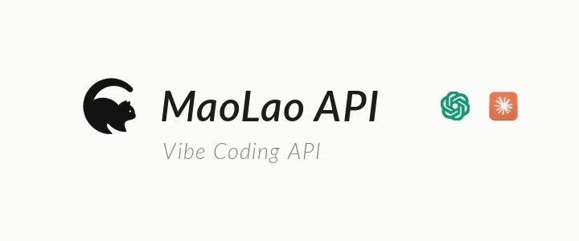
      </a>
    </td>
    <td><a href="https://maolaoapi.com"><strong>MaoLao API</strong></a><br>MaoLao API 是一家专注 VibeCoding 主流模型的 API 中转站，有自己的纯 Pro20X/Plus 号池，所以在低倍率的情况下还能做到低价套餐，套餐所有模型以及分组无限制！猫佬API：maolaoapi.com</td>
  </tr>
  <tr>
    <td align="center">
      <a href="https://unity2.ai/register?source=codexplusplus">
        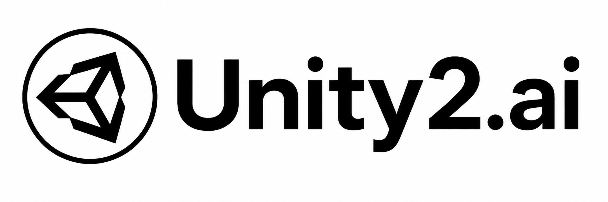
      </a>
    </td>
    <td><a href="https://unity2.ai/register?source=codexplusplus"><strong>Unity2.ai</strong></a><br>感谢 Unity2.ai 赞助了本项目！Unity2.ai 是面向个人开发者、团队和企业的高性能 AI 模型 API 中转平台，长期服务国内头部企业，日均承载超 300 亿 token 调用，支持 5000 RPM 级高并发。支持余额计费、首充赠额、组合订阅、企业开票和专属对接。通过<a href="https://unity2.ai/register?source=codexplusplus">此链接注册</a>可领取 $2 余额，加入官方群再送 $10 余额，最高可领 $12 免费额度。</td>
  </tr>
</table>

## 交流与支持

欢迎加入 Codex++ 交流群（QQ群：1103050832），反馈问题、交流使用体验或提出新功能建议。

微信群：<a href="https://docs.qq.com/doc/DQ2VOanZTTFZJcUpZ#">点击这里获取最新微信群二维码</a>。


Telegram 频道：<https://t.me/CodexPlusPlus>

如果 Codex++ 帮到了你，可以请我喝杯咖啡，或者随手赞赏支持一下继续维护。

<p align="center">
  
  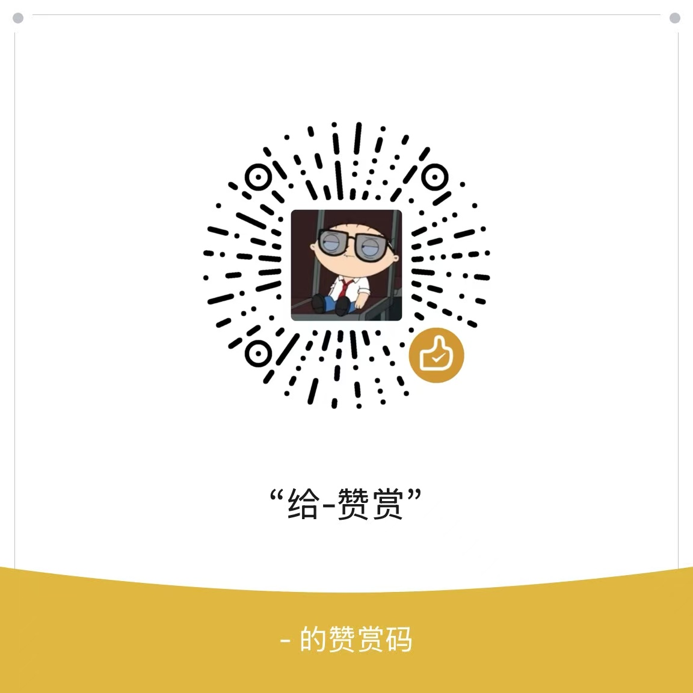
</p>

## 主要功能

- Rust 后端和静默 launcher，启动时不依赖额外运行时。
- Tauri + React 管理工具，支持深色/浅色切换。
- 外部 CDP 注入，不改 `app.asar`，不向 Codex 安装目录写入 DLL。
- 极义纯 API 模式：支持多个中转配置，默认阿里百炼千问兼容接口，APIMart 保留为备选，写入 Codex 兼容 provider，不切回官方 ChatGPT 登录态。
- 传统增强模式：插件入口解锁、特殊插件强制安装、会话删除、Markdown 导出、项目移动、Timeline 等。
- 用户脚本独立管理，可在启动时注入自定义脚本。
- Provider 同步：启动前同步本地会话 metadata，切换供应商后旧会话仍可见。
- Zed 打开入口：识别远程 SSH 上下文后，可从 Codex 直接打开对应文件到 Zed Remote Development。
- Upstream worktree 创建：可从 `upstream/<base-branch>` 创建新 worktree，创建前自动 fetch 远端分支，降低从陈旧本地 HEAD 派生导致的冲突风险。
- GitHub Release 自动更新，管理工具和静默启动器都会检测可用更新。
- Windows 单实例、无黑框启动、管理员权限清单、系统桌面路径识别。
- macOS x64/arm64 分架构 DMG，静默入口隐藏 Dock 图标。

## 痛点与解决

API Key 登录模式下，Codex 原生插件入口会提示需要登录 ChatGPT，导致插件功能无法正常使用：

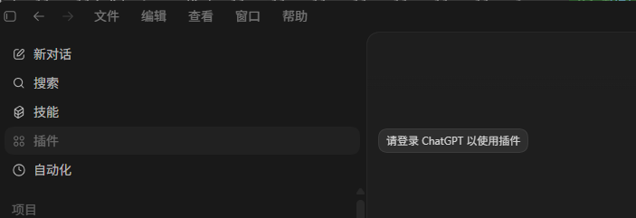

Codex 原生会话列表只有归档入口，没有真正的删除按钮：

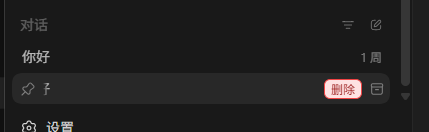

Codex++ 启动后会解锁插件入口，并在会话列表悬停时显示删除按钮：

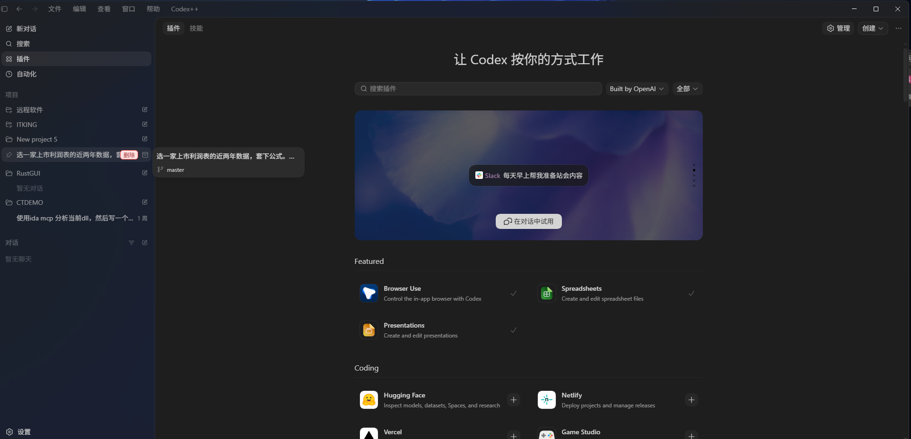

顶部菜单栏会出现 `Codex++`，可以查看后端状态并打开设置面板：

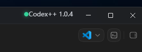
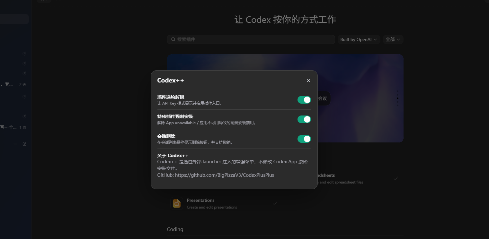

## 极义纯 API 接入

极义codex V1 不使用 ChatGPT 官方账号体系。用户登录由本地手机号验证码门禁负责，模型请求由阿里百炼千问兼容接口或后续极义中转接管，APIMart 保留为备选。

接入边界：

- 极义本地账号负责进入主应用和后续用户体系承接。
- 本地账号 session 默认 30 天有效，并记录本机设备标识；过期后需要重新手机号验证。
- 手机号登录后会写入本地用户、设备绑定和套餐额度模型，管理工具首页可编辑当前用户套餐和每日 token 额度，用于承接后续服务端用户体系。
- 管理工具设置页可保存腾讯云短信生产配置；`SmsSdkAppId`、签名、模板 ID、有效期和模板参数顺序写入 `~/.codex-session-delete/sms-provider.json`，`SecretId` 和 `SecretKey` 写入极义自己的 macOS 钥匙串默认账号 `jiyi-keychain:tencent-sms:secret-id` / `jiyi-keychain:tencent-sms:secret-key`。
- 短信默认保持本地干跑；关闭干跑且腾讯云参数完整后，验证码接口才会通过腾讯云 `SendSms` 真实发送，并要求 `SendStatusSet` 全部返回 `Ok` 后才落本地验证码。
- 阿里百炼 / 极义中转负责模型 Base URL、Key 和模型名称，APIMart 可作为备用供应商。
- 主入口不会因为已有本地登录态自动启动内置 Codex；用户点击“进入 Codex”时才会强制检查纯 API 配置，并默认通过极义本地请求代理转发模型请求。
- 本地 helper 会按当前用户记录今日请求数和 token 用量，可设置每日 token 上限；当前用户有本地套餐额度时优先使用套餐额度，超过上限时本机直接返回 `429 jiyi_quota_exceeded`。
- 管理工具首页可导出本地账号迁移报告，路径为 `~/.codex-session-delete/reports/jiyi-local-identity-report-*.json`；报告只包含脱敏手机号和稳定哈希，不导出明文手机号。
- 管理工具设置页可把脱敏账号、设备、套餐和用量摘要同步到本地账号服务端库，路径为 `~/.codex-session-delete/jiyi-codex-local-backend.sqlite`，用于本地部署阶段验证国产账号体系的服务端承接模型；同步时会创建极义默认团队并写入团队成员关系，为后续组织套餐和团队额度迁移预留数据结构；有效登录态会签发极义本地后端 session token，服务端库只保存 token hash，明文 token 写入极义自己的 macOS 钥匙串；服务端库已包含用户访问控制表，封禁用户会立即吊销该用户未过期 session，并阻止后续同步再次签发 session。
- 本地 helper 暴露极义账号后端 API：`GET /jiyi/v1/health`、`POST /jiyi/v1/sessions/verify`、`POST /jiyi/v1/sessions/revoke`、`GET /jiyi/v1/me`、`GET /jiyi/v1/quota/today`、`POST /jiyi/v1/usage/record`。API 使用 `Authorization: Bearer <token>` 或请求体 `accessToken` 做 session 校验，只返回脱敏手机号、设备、套餐和服务端额度快照，不返回明文手机号或明文 token；本地账号退出时会吊销后端 session 并清理 `jiyi-keychain:local-backend-session:active`；模型请求成功记入本地用量库后，也会在存在后端 session token 时实时增量写入本地后端额度摘要。
- 管理工具设置页可生成服务端同步请求包，也可直接向配置的极义服务端 Endpoint 发起同步；请求包路径为 `~/.codex-session-delete/reports/jiyi-identity-sync-request-*.json`，响应审计路径为 `~/.codex-session-delete/reports/jiyi-identity-sync-response-*.json`；同步 API Key 保存到极义自己的 macOS 钥匙串，请求包和响应审计不落明文 Key。
- 管理工具设置页可启用“极义托管代理”：内置 Codex 仍只连接本机 `127.0.0.1`，本地 helper 使用 `jiyi-keychain:local-backend-session:active` 转发到托管代理 Endpoint，不把百炼或中转站主 Key 写入客户端配置。
- 本地部署阶段提供 `jiyi-managed-proxy` 托管代理服务：默认监听 `127.0.0.1:57421`，从环境变量读取上游百炼 / 中转站 Key，只接受极义后端 session token，并把 Responses 用量写回本地后端额度摘要；后端库默认使用 `~/.codex-session-delete/jiyi-codex-local-backend.sqlite`，也可通过 `JIYI_MANAGED_PROXY_DB_PATH` 显式指定，健康检查会返回实际 `backendDbPath`；托管代理还提供 `GET /jiyi/v1/admin/users` 用户运营查询、`GET /jiyi/v1/admin/teams` 团队运营查询、`POST /jiyi/v1/admin/users/entitlement` 用户套餐/额度调整、`POST /jiyi/v1/admin/teams/entitlement` 团队套餐/额度调整、`GET /jiyi/v1/admin/billing/renewals` 续费记录查询、`POST /jiyi/v1/admin/billing/renewals` 手工续费/支付凭证落账、`POST /jiyi/v1/billing/payment-webhook` 支付网关回调承接、`POST /jiyi/v1/admin/billing/reconcile` 支付事件自动对账、`POST /jiyi/v1/admin/users/block` 和 `POST /jiyi/v1/admin/users/unblock` 管理接口。`JIYI_MANAGED_PROXY_ADMIN_API_KEY` 是全量管理 Key；`JIYI_MANAGED_PROXY_USER_READ_API_KEY` 只能查用户和团队，`JIYI_MANAGED_PROXY_BILLING_API_KEY` 只能调用户或团队套餐额度、记录续费和触发对账，`JIYI_MANAGED_PROXY_PAYMENT_WEBHOOK_API_KEY` 只给支付网关回调使用，`JIYI_MANAGED_PROXY_PAYMENT_WEBHOOK_SIGNATURE_SECRET` 配置后会强制校验 `X-Jiyi-Payment-Timestamp` 和 `X-Jiyi-Payment-Signature` 的 HMAC-SHA256 签名；配置 `JIYI_MANAGED_PROXY_ALIPAY_PUBLIC_KEY` / `_PATH` 或 `JIYI_MANAGED_PROXY_WECHATPAY_PUBLIC_KEY` / `_PATH` 后，匹配支付宝或微信支付的回调会在落账前强制执行官方 RSA-SHA256 验签；`JIYI_MANAGED_PROXY_ACCESS_API_KEY` 只能封禁/解封，`JIYI_MANAGED_PROXY_AUDIT_API_KEY` 只能查审计；`GET /jiyi/v1/admin/audit/events` 支持 `eventType`、`actorType`、`subjectUserId` 和 `limit` 过滤。用户套餐调整、续费落账和 paid 支付回调会立即影响后续 quota，团队套餐调整和团队续费会记录审计并返回团队剩余额度快照，封禁后 `/v1/models` 和 `/v1/responses` 会在转发上游前拒绝该用户；DMG 会把该二进制作为主应用和管理工具的 sidecar 一起打包。
- 管理工具设置页可以直接检查、启动和停止本地 `jiyi-managed-proxy`。启动后会把托管代理 Endpoint 设置为 `http://127.0.0.1:57421`，进程 PID 和日志写入 `~/.codex-session-delete/jiyi-managed-proxy.pid` / `~/.codex-session-delete/jiyi-managed-proxy.log`；状态区展示托管代理后端库路径、上游 Key、同步 Key、管理 Key、用户只读 Key、计费 Key、支付回调 Key、通用支付验签、支付宝验签、微信验签、风控 Key 和审计 Key 配置状态；停止前会校验 PID 对应命令行，避免影响原版 Codex。
- 如果缺少 API Key，会阻止启动，不回退到 ChatGPT 登录。
- 真实 Key 不应写入文档、截图或 issue。

使用流程：

1. 打开 `极义codex`，完成手机号验证码登录。
2. 在 `极义codex 管理工具` 里确认阿里百炼 / 极义中转 Base URL、API Key、模型名称；公开版可改为启用极义托管代理 Endpoint。
3. 保存供应商配置，并使用“极义纯 API”模式。
4. 回到 `极义codex`，点击“进入 Codex”进入使用界面。

本地托管代理可这样启动：

```bash
mkdir -p "$HOME/.codex-session-delete/bin"
cp /Applications/极义codex.app/Contents/MacOS/jiyi-managed-proxy \
  "$HOME/.codex-session-delete/bin/jiyi-managed-proxy"
chmod 755 "$HOME/.codex-session-delete/bin/jiyi-managed-proxy"
JIYI_MANAGED_PROXY_UPSTREAM_API_KEY="你的服务端上游 key" \
JIYI_MANAGED_PROXY_UPSTREAM_BASE_URL="https://dashscope.aliyuncs.com/compatible-mode/v1" \
JIYI_MANAGED_PROXY_SYNC_API_KEY="你的极义账号同步 key" \
JIYI_MANAGED_PROXY_ADMIN_API_KEY="你的极义管理 key" \
JIYI_MANAGED_PROXY_USER_READ_API_KEY="你的极义用户只读 key" \
JIYI_MANAGED_PROXY_BILLING_API_KEY="你的极义计费 key" \
JIYI_MANAGED_PROXY_PAYMENT_WEBHOOK_API_KEY="你的极义支付回调 key" \
JIYI_MANAGED_PROXY_PAYMENT_WEBHOOK_SIGNATURE_SECRET="你的极义支付回调验签密钥" \
JIYI_MANAGED_PROXY_ALIPAY_PUBLIC_KEY_PATH="/path/to/alipay-public.pem" \
JIYI_MANAGED_PROXY_WECHATPAY_PUBLIC_KEY_PATH="/path/to/wechatpay-public.pem" \
JIYI_MANAGED_PROXY_ACCESS_API_KEY="你的极义风控 key" \
JIYI_MANAGED_PROXY_AUDIT_API_KEY="你的极义审计只读 key" \
JIYI_MANAGED_PROXY_DB_PATH="$HOME/.codex-session-delete/jiyi-codex-local-backend.sqlite" \
"$HOME/.codex-session-delete/bin/jiyi-managed-proxy"
```

更推荐在 `极义codex 管理工具 -> 设置 -> 极义账号服务端` 中点击“启动本地托管代理”，由管理工具读取当前供应商配置、写入本机 Endpoint 并完成健康检查。

如果要把本地托管代理作为 macOS 常驻服务运行，可以安装 LaunchAgent：

```bash
bash /Applications/极义codex.app/Contents/Resources/server/macos/install-managed-proxy-launchd.sh
```

首次安装会创建 `~/.codex-session-delete/jiyi-managed-proxy.env`，把 `JIYI_MANAGED_PROXY_UPSTREAM_API_KEY`、`JIYI_MANAGED_PROXY_SYNC_API_KEY`、全量管理 Key、支付回调 Key、支付回调 HMAC 验签密钥、支付宝/微信支付官方公钥路径或对应角色 Key 填入后重新 kickstart 服务即可。卸载脚本在同一目录：

```bash
bash /Applications/极义codex.app/Contents/Resources/server/macos/uninstall-managed-proxy-launchd.sh
```

更完整的本地服务部署说明见 `docs/极义codex_本地服务部署.md`。

远端托管代理部署也已经提供模板。单机 Linux 服务器可以用 systemd：

```bash
cargo build --release -p jiyi-managed-proxy
sudo scripts/server/linux/install-managed-proxy-systemd.sh target/release/jiyi-managed-proxy
```

容器环境可以用：

```bash
docker build -f apps/jiyi-managed-proxy/Dockerfile -t jiyi-managed-proxy:1.2.4 .
```

systemd 和 Docker 模板都要求通过服务端环境变量提供 `JIYI_MANAGED_PROXY_UPSTREAM_API_KEY`、`JIYI_MANAGED_PROXY_SYNC_API_KEY`、全量管理 Key、支付回调 Key、支付回调验签密钥、支付宝/微信支付官方公钥或对应角色 Key，不会把上游 Key 写入客户端。远端部署细节见 `docs/极义codex_远端托管代理部署.md`。

本机验收安装建议使用脚本，不要手工拖拽覆盖：

```bash
scripts/installer/macos/install-local-dmg.sh dist/macos/JiyiCodex-1.2.4-macos-arm64.dmg
```

极义codex 会在自己的隔离 Codex Home 中写入类似配置：

```text
~/.codex-session-delete/codex-home/config.toml
```

```toml
model = "qwen3.7-plus"
model_provider = "custom"

[model_providers.custom]
name = "custom"
wire_api = "responses"
requires_openai_auth = true
base_url = "http://127.0.0.1:57321/v1"
experimental_bearer_token = "jiyi-local-proxy"
```

同时会在 `~/.codex-session-delete/codex-home/auth.json` 中写入 `OPENAI_API_KEY` 兼容字段，值为 `jiyi-local-proxy` 占位 token。真实百炼 / 极义中转 Key 保存在 macOS 钥匙串、环境变量或下载目录默认百炼 Key 文件中，极义 settings 只保留 `jiyi-keychain:` 引用，由本地 helper 代理 `/responses` 和 `/models` 请求；管理工具首页只展示“极义钥匙串 / 百炼环境变量 / 下载目录百炼 Key / APIMart 备选”等来源枚举，不展示路径或 Key 明文；启用托管代理时，helper 改用极义后端 session token 调用托管代理，不读取百炼或中转站主 Key；这里的字段名是 Codex 客户端兼容要求，不代表用户需要 ChatGPT 账号。

原版 Codex 的 `~/.codex/config.toml` 和 `~/.codex/auth.json` 不作为极义运行目录使用；极义主壳和内置客户端启动时会守护原版配置，避免极义路径、百炼或 APIMart 配置写回原版 Codex。污染判断识别极义路径、百炼/APIMart、`jiyi-local-proxy`、`jiyi-keychain:` 和 `qwen3.7-plus` 等极义痕迹，不会因为原版用户自己配置了 `OPENAI_API_KEY` 就回滚原版配置。极义主入口只启动包内/运行时的 `JiyiCodexClient.app`，不再使用 `/Applications/Codex.app` 或旧的 `Contents/Resources/Codex.app` 作为兜底；运行时会拒绝仍声明 `codex://` 的客户端，并通过 `--user-data-dir=~/.codex-session-delete/codex-client-user-data` 隔离 Electron/Chromium 用户数据，同时清空通用 `OPENAI_*`、`DASHSCOPE_API_KEY`、`BAILIAN_API_KEY`、`QWEN_API_KEY`、`APIMART_API_KEY`、`CUSTOM_OPENAI_API_KEY` 和 `JIYI_CODEX_API_KEY` 环境变量。管理工具“安装维护”页提供“修复原版隔离”，会备份后清理原版 `~/.codex` 与原版 Codex App Support 中的极义/百炼/APIMart 残留状态，不改 `/Applications/Codex.app` 本体。

管理工具的“安装维护”页提供“发布前检查”，会检查完整 DMG、bundle id、签名、托管代理 sidecar、主入口无原版兜底、内置客户端 URL Scheme 隔离、内置客户端浏览器数据隔离、内置客户端环境变量隔离、原版 `~/.codex` 与原版 Codex App Support 隔离、本地账号、腾讯云短信生产配置、本地用户套餐模型、本地用量记账、本地账号服务端库、极义账号服务端同步、极义托管代理、托管代理全量管理 Key、用户只读 Key、计费 Key、风控 Key、审计 Key、极义 Codex Home Key 隔离和 Key 分发风险。

本地账号后端会记录身份同步、session 吊销、用量写入、套餐/额度调整、封禁和解封等服务端审计事件；`jiyi-managed-proxy` 提供 `GET /jiyi/v1/admin/audit/events?limit=50` 管理接口，接受全量管理 Key 或审计只读 Key 鉴权。用户只读 Key 不能改套餐或封禁，计费 Key 不能查用户或封禁，风控 Key 不能查用户或调套餐，审计 Key 不能访问用户列表、套餐调整、封禁或解封接口。审计查询支持 `eventType`、`actorType` 和 `subjectUserId` 过滤；审计事件只保存 actor、subject、原因、脱敏 metadata 和时间，不保存明文 session token、同步 Key、管理 Key、角色 Key、审计 Key 或上游 Key；管理工具工作台会展示审计事件数量和最近审计时间。macOS 本地启动托管代理时，极义会把包内 sidecar 复制到 `~/.codex-session-delete/bin/jiyi-managed-proxy` 后执行，避免直接从大型 App bundle 内运行 ad-hoc sidecar 被系统拒绝；这仍然只使用极义状态目录，不写原版 Codex。

## 增强功能

增强功能在管理工具中统一开关。默认开启增强注入；关闭后不会注入 Codex++ 菜单和脚本。

如果启用中转注入模式，插件入口解锁和强制安装不再需要，界面会提示“中转注入模式下无需开启”。会话删除、导出、移动、Timeline、推荐内容和用户脚本等增强仍可继续使用。

## 推荐内容

推荐内容来自远程广告列表：

```text
https://raw.githubusercontent.com/BigPizzaV3/Ad-List/main/ads.json
https://cdn.jsdelivr.net/gh/BigPizzaV3/Ad-List@main/ads.json
```

请求时会自动追加 `?v=时间戳` 绕开 CDN 旧缓存。推荐内容加载慢不会影响后端连接状态。

## 安装包

极义codex 通过 GitHub Release 发布安装包。macOS 会生成 Intel x64 和 Apple Silicon arm64 两个 DMG。

管理工具的“关于”页可以检查更新；“安装维护”页可以运行发布前检查。

当前 1.2.4 macOS 发布说明已放在飞书在线文档：

```text
https://bchje44bsl.feishu.cn/docx/GIxYdIdbSokkIexO3oGcLyGinZg
```

## 数据位置

- 原版 Codex 配置：`~/.codex/config.toml`
- 原版 Codex 登录状态：`~/.codex/auth.json`
- Codex 本地数据库：`~/.codex/state_5.sqlite`
- 极义codex 状态与日志：`~/.codex-session-delete/`
- 极义内置 Codex Home：`~/.codex-session-delete/codex-home`
- 极义内置客户端浏览器数据：`~/.codex-session-delete/codex-client-user-data`
- 极义手机号登录和本地用量库：`~/.codex-session-delete/jiyi-codex-local.sqlite`
- 极义旧版本备份归档：`~/.codex-session-delete/app-backups.noindex/`
- Provider 同步备份：`~/.codex/backups_state/provider-sync`

## 常见问题

### Codex++ 菜单没出现

确认是从 `Codex++` 入口启动，而不是原版 Codex。也可以打开管理工具的“诊断”和“日志”页面查看注入状态。

### 插件内显示后端连不上

先在浏览器或 PowerShell 里测试：

```powershell
Invoke-RestMethod -Method Post -Uri http://127.0.0.1:57321/backend/status -Body "{}" -ContentType "application/json"
```

如果接口正常，但插件仍显示超时，通常是 Codex 页面里的 CDP bridge 或脚本缓存问题。重启极义codex，或在管理工具里查看日志中的 `renderer.script_loaded`、`bridge.request`、`bridge.response`。

### Upstream worktree 和 Codex 原生创建有什么区别

Codex++ 的 Upstream worktree 功能等价于先更新远端分支，再执行：

```bash
git worktree add -b <new-branch> <worktree-path> upstream/<base-branch>
```

这样新 worktree 从最新的远端跟踪分支开始，而不是从当前会话所在的本地 HEAD 开始。如果 Codex++ 无法安全识别当前 Codex 版本的原生 worktree 创建表单，请从 Codex++ 菜单中手动填写仓库路径、分支名、worktree 路径、remote 和 base branch。

### macOS 提示无法打开或已损坏

当前安装包未签名/未公证时，macOS Gatekeeper 可能拦截，出现“已损坏，无法打开”的提示：

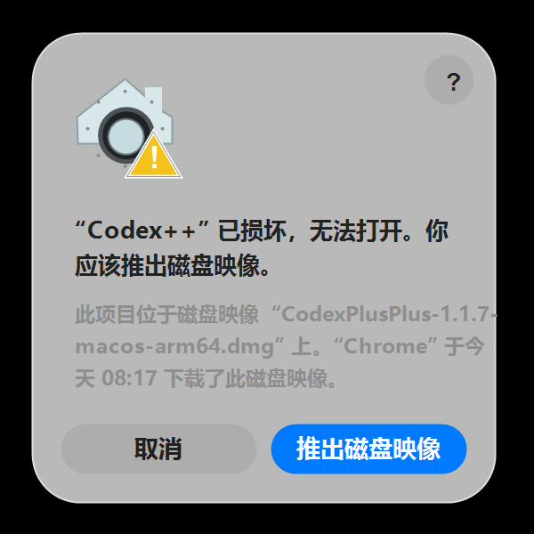

如果遇到该提示，可以在终端执行下面两条命令，解除苹果系统的安全隔离限制：

```bash
sudo xattr -rd com.apple.quarantine /Applications/极义codex\ 管理工具.app
sudo xattr -rd com.apple.quarantine /Applications/极义codex.app
```

执行后重新打开 `极义codex` 或 `极义codex 管理工具` 即可。

正式对外分发时，不应让用户手动解除隔离。打包脚本支持 Developer ID 和 Apple 公证环境变量；未配置时仍生成本机 ad-hoc 验收包，配置后会启用 Hardened Runtime、签名 DMG、提交 notarytool 并 staple：

```bash
JIYI_CODESIGN_IDENTITY="Developer ID Application: 极义团队名称 (TEAMID)" \
JIYI_NOTARIZE=1 \
APPLE_ID="apple-id@example.com" \
APPLE_APP_SPECIFIC_PASSWORD="xxxx-xxxx-xxxx-xxxx" \
APPLE_TEAM_ID="TEAMID" \
bash scripts/installer/macos/package-dmg.sh 1.2.4 arm64
```

也可以使用 App Store Connect API Key：`ASC_KEY_ID`、`ASC_ISSUER_ID`、`ASC_KEY_PATH`。

### macOS Intel 能用吗

可以。Release 会分别提供 `macos-x64.dmg` 和 `macos-arm64.dmg`。Intel Mac 下载 x64 包，Apple Silicon 下载 arm64 包。

## 开发

```bash
# 前端检查
cd apps/codex-plus-manager
npm install
npm run check
npm run vite:build

# Rust 检查
cd ../..
cargo fmt --check
cargo test
cargo build --release
```

主要结构：

```text
apps/
  codex-plus-launcher/          静默启动入口
  codex-plus-manager/           Tauri 管理工具
assets/inject/
  renderer-inject.js            注入到 Codex 渲染端的增强脚本
crates/
  codex-plus-core/              启动、注入、配置、更新、安装、桥接等核心逻辑
  codex-plus-data/              会话数据、导出、Provider 同步
scripts/installer/
  windows/CodexPlusPlus.nsi     Windows NSIS 安装包
  macos/package-dmg.sh          macOS DMG 打包
```

## 友情链接

- [LINUX DO](https://linux.do)

## 说明

Codex++ 是外部增强工具，不修改 Codex App 原始文件。Codex App 更新后，如果页面结构变化，可能需要更新注入脚本。
